{width="8.56521762904637in"
height="11.692916666666667in"}

# Contents

[Purpose 1](#purpose)

[Use Cases 1](#use-cases)

[Section 1: Accept the CNF Private Offer & Account Onboarding](#section-1-accept-the-cnf-private-offer-account-onboarding)

[Section 2: Common Architecture Patterns](#section-2-common-architecture-patterns)

[Section 3: Deploying CNF Instances](#section-3-deploying-cnf-instances)

[Section 4: Providing Feedback](#section-4-providing-feedback)

# Purpose

The purpose of this document is to guide you through onboarding your AWS
accounts onto FortiGate CNF and getting hands-on experience of the
solution. One of the FortiCNF's biggest strengths is how it simplifies
the security operations in multi-cloud environment. In this guide, we
want to show you how FortiCNF can provide this experience.

# Use Cases

This Guide is divided into four main sections:

> Section 1: Accepting the AWS Private Offer & Account Onboarding
>
> Section 2: Common Architecture Patterns
>
> Section 3: Deploying CNF Instances
>
> Section 4: Providing Feedback

# Section 1: Accept the CNF Private Offer & Account Onboarding

Your AWS account ID you provided should have a private offer extended to
it. This should be seen under the following [private offer
URL](https://aws.amazon.com/marketplace/fulfillment?productId=f6be253f-0f7f-4174-be50-c0016aede94f&offerId=offer-7dxuqyxfgboiq)
once you are logged into that AWS account. Then you should be able to
accept the private offer.

1.  Once you have accepted the private offer, you should be able to
    click a link to navigate to the product registration page.

> {width="5.848591426071741in"
> height="4.687836832895888in"}

2.  If you do not already have a FortiCloud account, the
    [Register](https://support.fortinet.com/cred/#/sign-up) button will
    navigate you to where you can create your own account quickly.
    Otherwise move on the step 2 and login to your existing FortiCloud
    Account. You should see this page showing your information and that
    the subscription has been successfully applied to your FortiCloud
    account.

> 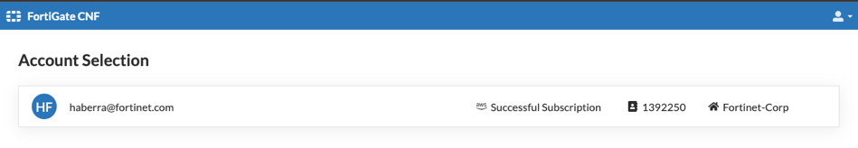{width="6.341549650043745in"
> height="1.0976224846894138in"}

3.  Click on your account and you will now be on the dashboard of
    FortiGate CNF.

> 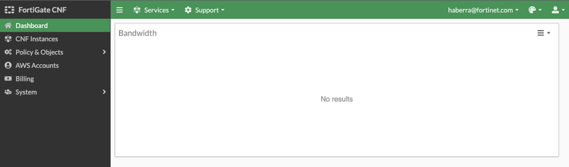{width="6.327465004374453in"
> height="1.869753937007874in"}

4.  Next, navigate to AWS Accounts, then click New to start the add
    account wizard.

> 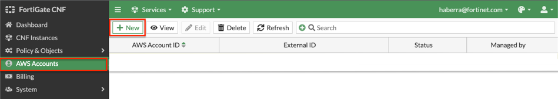{width="6.3345067804024495in"
> height="1.142516404199475in"}

5.  Provide your whitelisted AWS account ID and select Launch
    CloudFormation Template. This will redirect you to the
    CloudFormation Console in your AWS account (if you are logged into
    it).

> 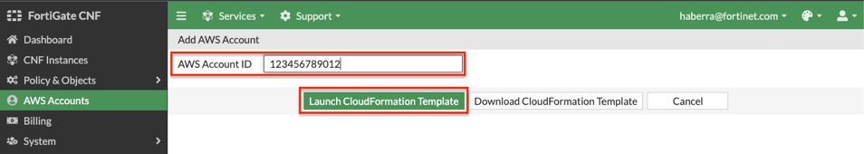{width="6.369718941382327in"
> height="1.1452066929133857in"}

6.  This CloudFormation Template creates the following items:

    a.  S3 bucket for sending logs

    b.  IAM Cross Account Role which allows us to manage VPC endpoints,
        describe VPCs, push logs to S3, and describe instances and EKS
        clusters for the SDN connector feature (dynamic address objects
        based on metadata).

    c.  Custom resources which kicks off automation on our managed
        accounts to complete onboarding the AWS account.

7.  Please follow through the create stack wizard **without changing any
    of the parameter values**. Simply follow the steps outlined in the
    FortiGate CNF.

> 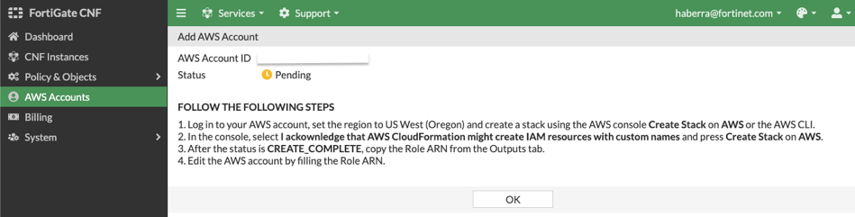{width="6.348591426071741in"
> height="1.6181616360454942in"}

8.  Once the CloudFormation template has created successfully, you
    should see your account showing 'Success' in the AWS account page of
    FortiGate CNF.

> {width="6.426056430446194in"
> height="1.1134809711286089in"}

9.  This concludes this section.

# Section 2: Common Architecture Patterns

FortiGate CNF is a SaaS offering that on the backend uses FortiGates,
AWS Gateway Load Balancer (GWLB), and VPC endpoints to intercept
customer traffic and inspect this transparently. As part of the
deployment process for FortiGate CNF instances, the customer environment
will need to implement VPC and ingress routing at the Internet Gateway
(IGW) to intercept the traffic to be inspected. The architectures below
go over common architecture patterns.

The FortiGate CNF security stack which includes the AWS GWLB and other
components will deployed in Fortinet managed AWS accounts. The details
of the diagram are simply an example of the main components used in
FortiGate CNF. This is more to understand what happens when customer
traffic is received at our GWLB.

{width="6.329117454068242in"
height="3.560430883639545in"}

With GWLB and AWS Transit Gateway (TGW), you can have centralized and
decentralized designs. Decentralized designs do not require any routing
between the protected VPC and another VPC through TGW. These designs
allow simple service insertion with minimal routing changes to the VPC
route table. The **yellow numbers** show the initial packet flow for a
session and how it is routed (using ingress and VPC routes) to the
GWLB/VPC endpoint which then sends traffic to the FortiGate CNF stack.
The **blue numbers** show the returned traffic after inspection by the
FortiGate CNF stack.

**Note:** [Any subnet where the VPC endpoints for the FortiGate CNF
instances are to be deployed will need to have a specific tag name and
value to be seen by FortiGate CNF portal.]{.ul} Currently this is tag
name '**fortigatecnf_subnet_type**' and tag value '**endpoint**'.

{width="6.1788342082239724in"
height="3.4758891076115486in"}

{width="6.2288735783027125in"
height="3.5040398075240593in"}

{width="6.215675853018372in"
height="3.4966152668416446in"}

{width="6.1090277777777775in"
height="3.436619641294838in"}

Centralized designs require the use of TGW to provide a simple hub and
spoke architecture to inspect traffic. These can simplify east-west and
egress traffic inspection needs while removing the need for IGWs and NAT
Gateways to be deployed in each protected VPC for egress inspection. You
can still mix a decentralized architecture to inspect ingress and even
egress traffic while leveraging the centralized design for all east-west
inspection.

The **yellow numbers** show the initial packet flow for a session and
how it is routed (using ingress and VPC routes) to the GWLB/VPC endpoint
which then sends traffic to the FortiGate CNF stack. The **blue numbers
(east-west)** and **purple numbers (egress)** show the returned traffic
after inspection by the FortiGate CNF stack.

{width="6.609154636920385in"
height="3.717965879265092in"}

{width="6.580986439195101in"
height="3.702120516185477in"}

{width="6.616197506561679in"
height="3.7219280402449693in"}

# Section 3: Deploying CNF Instances

Once you have a desired architecture in mind, you can proceed with
tagging the subnets where the VPC endpoints for FortiGate CNF will be
deployed. These should have a tag name '**fortigatecnf_subnet_type**'
and tag value '**endpoint**' applied.

1.  In the FortiGate CNF portal, navigate to CNF instances and click
    New.

> 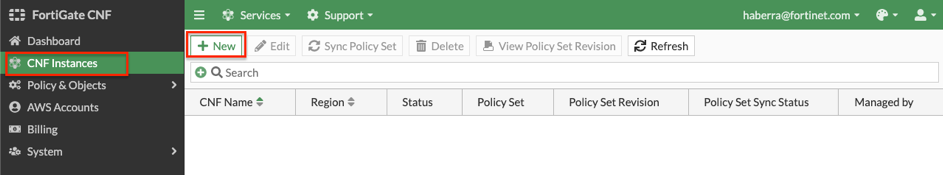{width="6.303732502187227in"
> height="1.1810444006999126in"}

2.  Provide a name for the CNF instance, the region for deployment, and
    select the S3 bucket created by CloudFormation for the logging
    destination. Then click Save. This will drop you back to the list of
    CNF instances while this is deployed in the background.

> 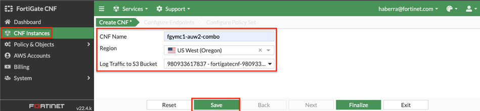{width="6.351388888888889in"
> height="1.4825995188101488in"}
>
> 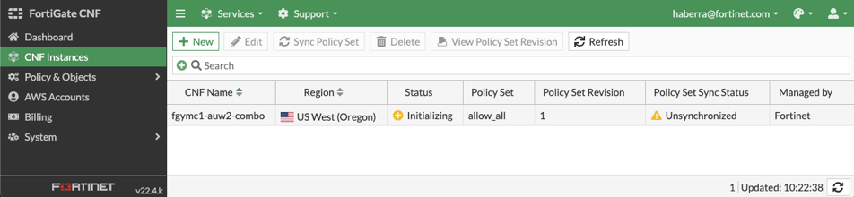{width="6.355634295713036in"
> height="1.4744586614173227in"}

3.  The CNF Instance should show up as active after roughly 10 minutes.
    Then you can select and edit it to deploy endpoints and assign a
    policy set.

> 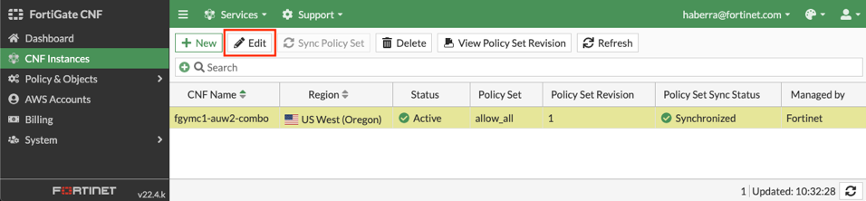{width="6.390845363079615in"
> height="1.4881364829396326in"}
>
> 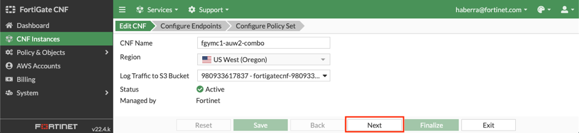{width="6.306338582677165in"
> height="1.4624179790026246in"}

4.  On the Configure Endpoints section of the wizard, click the New
    button. Then you can select the account, VPC, and subnet to deploy
    the VPC endpoint to. Repeat this step for all subnets in your
    architecture where a VPC endpoint should be deployed, then click the
    Next button.

> 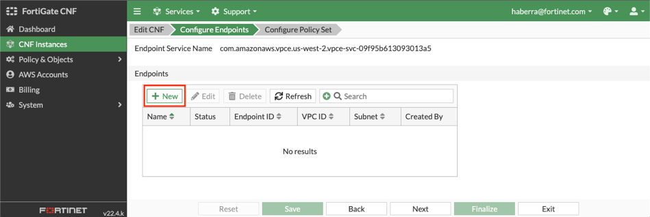{width="6.3345067804024495in"
> height="2.136379046369204in"}
>
> 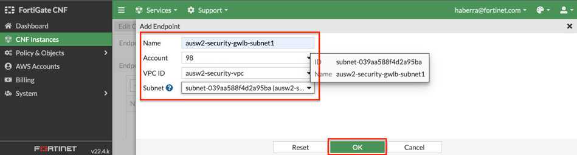{width="6.348591426071741in"
> height="1.722146762904637in"}

5.  On the Configure Policy Set section of the wizard, use the default
    'allow_all' policy allow all traffic from a Layer 4 perspective and
    click Finalize to push that default policy. You should then see the
    list of CNF instances again.

> 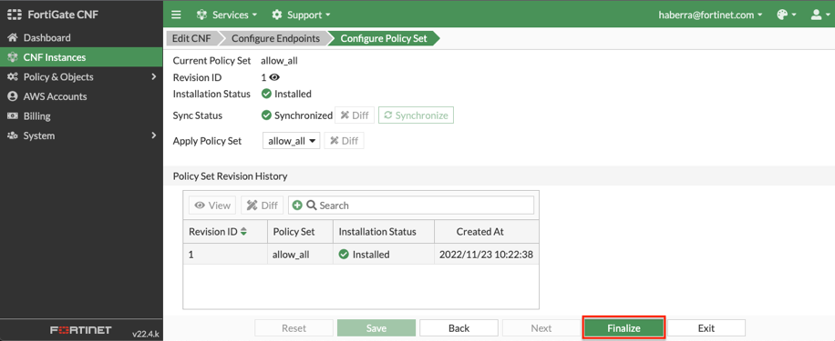{width="6.121014873140857in" height="2.5in"}
>
> 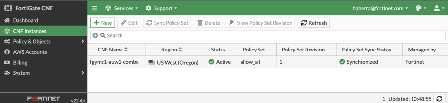{width="6.151408573928259in"
> height="1.4264905949256343in"}

6.  To validate all VPC endpoints have been deployed, edit the CNF
    instance and click Next to view the endpoints on the Configure
    Endpoints section of the wizard.

> 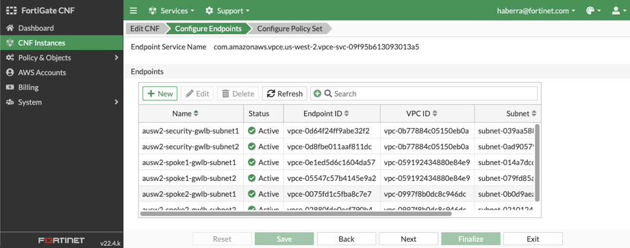{width="6.151408573928259in"
> height="2.4193186789151357in"}

7.  To customize the actual Layer 4 rules and security profile groups
    applied, navigate to Policy & Objects > Policy Sets to create your
    own L4 rules. Security profiles for DNS filtering and blocking
    malicious URLs and Botnet C&C can be configured under Policy &
    Objects > Security Profile Groups.

> **Note:** There will be more features added directly in the FortiGate
> CNF portal over time and shortly after release more security profiles
> and policy sets can be managed directly by FortiManager.
>
> {width="7.25in" height="2.188888888888889in"}
>
> {width="7.25in" height="2.1708333333333334in"}

8.  At this point you will need to create ingress and VPC routes to
    direct traffic to the VPC endpoints that were created by FortiGate
    CNF for inspection. You can confirm the VPC endpoints are visible in
    your AWS account.

> {width="6.3978871391076115in"
> height="4.759807524059492in"}

9.  As traffic is generated, you will see traffic as well as other logs
    generated in the S3 bucket over time.

> Note: Currently logging to S3 is what is available. Logging to remote
> Syslog and FortiAnalyzer are being developed. In the meantime, we
> recommend using the AWS CLI S3 sync command to download all logs and
> parse them quickly with grep.

10. This concludes this section.

# Section 4: Providing Feedback

We truly appreciate your time and efforts to review FortiGate CNF as a
launch partner and value your feedback greatly. Please take the time to
capture your thoughts on:

1.  What do you like about the FortiGate CNF solution. Does anything
    beneficial stand out in comparison to the competition?

2.  What room for improvement do you see in the solution. Is there
    anything we are missing that the competition has or customers are
    asking for but no solution exists on the market?

3.  For any issues or enhancements, please capture screenshots and
    provide as much detail as possible. What problem does the
    enhancement solve?

4.  What are your thoughts on using FortiManager to manage policy and
    objects vs having all items in the FortiGate CNF portal? Any
    pros/cons for leaning heavy towards one side or is parity expected
    by customers?
