# Secure AWS workloads with FortiGate CNF SaaS

## Welcome!

AWS Software-Defined Networking (SDN) is elastic, complex, and quite different than traditional on-premise networking. In this workshop you will learn how to use FortiGate Cloud Native Firewall as a Service (FortiGate CNF) to protect your AWS workloads deployed in common architecture patterns.

### Learning Objectives

  * Learn common AWS networking concepts such as routing traffic in and out of VPCs for various traffic flows
  * Interact with FortiGate CNF Portal to deploy CNF instances, build security policy sets, and deploy them
  * Test traffic flows in an example environment and use FortiGate CNF to control traffic flows

### Workshop Components

  * AWS Marketplace
  * FortiCloud 
  * FortiGate CNF Portal
  * AWS CloudFormation Templates (Infrastructure as Code, IaC)
  * AWS SDN (AWS intrinsic router and route tables in a VPC)
  * AWS Gateway Load Balancer (GWLB)
  * AWS Transit Gateway (TGW)
  * AWS EC2 Instances (Amazon Linux OS)

# Workshop Logistics

## Accessing the AWS environment

--TBD--

## AWS Reference Architecture Diagram

## Notes:

  * With AWS networking there are several different ways to organize your AWS architecture to take advantage of FortiGate CNF traffic inspection. The important point to know is that as long as the traffic flow has a symmetrical routing path (for forward and reverse flows), the architecture will work.
  * This diagram will highlight two main designs that are common architecture patterns for securing traffic flows.
    * Distributed Ingress + Egress
	* Centralized Egress + East-West

### Learning Objectives

  * Understand AWS Networking Concepts
  * Understand AWS Common Architecture Patterns
  * Understand FortiGate CNF terminology
  * Subscribe to FortiGate CNF
  * Onboard an AWS account
  * Deploy a FortiGate CNF Instance & GWLBe endpoints
  * Create a policy set and apply it to a FortiGate CNF Instance
  * Test traffic flows (distributed in + egress and centralized e-w + egress)

# AWS Networking Concepts

Before diving into the reference architecture for this workshop, let's review core AWS networking concepts.

AWS Virtual Private Cloud (VPC) is a logically isolated section of the AWS Cloud where you can launch AWS resources in a virtual network that you define. You have complete control over your virtual networking environment, including selection of your own IP address range, creation of subnets, and configuration of route tables and network gateways.

Availability zones (AZ) are multiple, isolated locations within each Region that have independent power, cooling, physical security, etc. A VPC spans all of the AZs in the Region.

Region, is a collection of multiple regional AZs in a geographic location. The collection of AZs in the same region are all interconnected via redundant, ultra-low-latency networks.

All subnets within a VPC are able to reach each other with the default or intrinsic router within the VPC. All resources in a subnet use the intrinsic router as the default gateway. Each subnet must be associated with a VPC route table, which specifies the allowed routes for outbound traffic leaving the subnet.

An internet gateway (IGW) is a horizontally scaled, redundant, and highly available VPC component that allows communication between instances in your VPC and the internet. It therefore imposes no availability risks or bandwidth constraints on your network traffic.

AWS NAT Gateway (NAT GW) is a Network Address Translation (NAT) service. You can use a NAT gateway so that instances in a private subnet can connect to services outside your VPC but external services cannot initiate a connection with those instances.

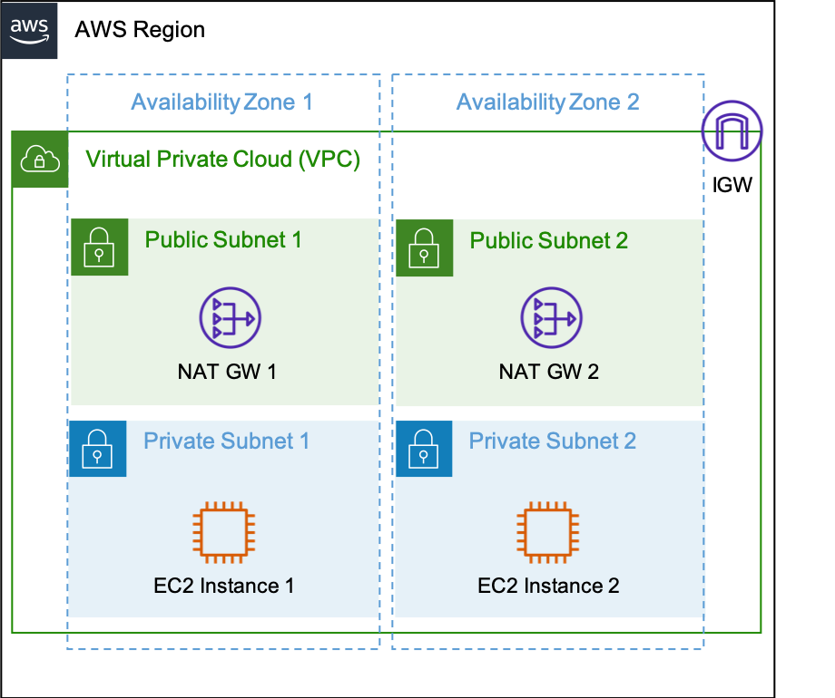

AWS Transit Gateway (TGW) is a highly scalable cloud router that connects your VPCs in the same region to each other, to on-premise networks, and even to the internet through one hub. With the use of multiple route tables for a single TGW, you can design hub and spoke routing for traffic inspection and enforcement of security policy across multiple VPCs.

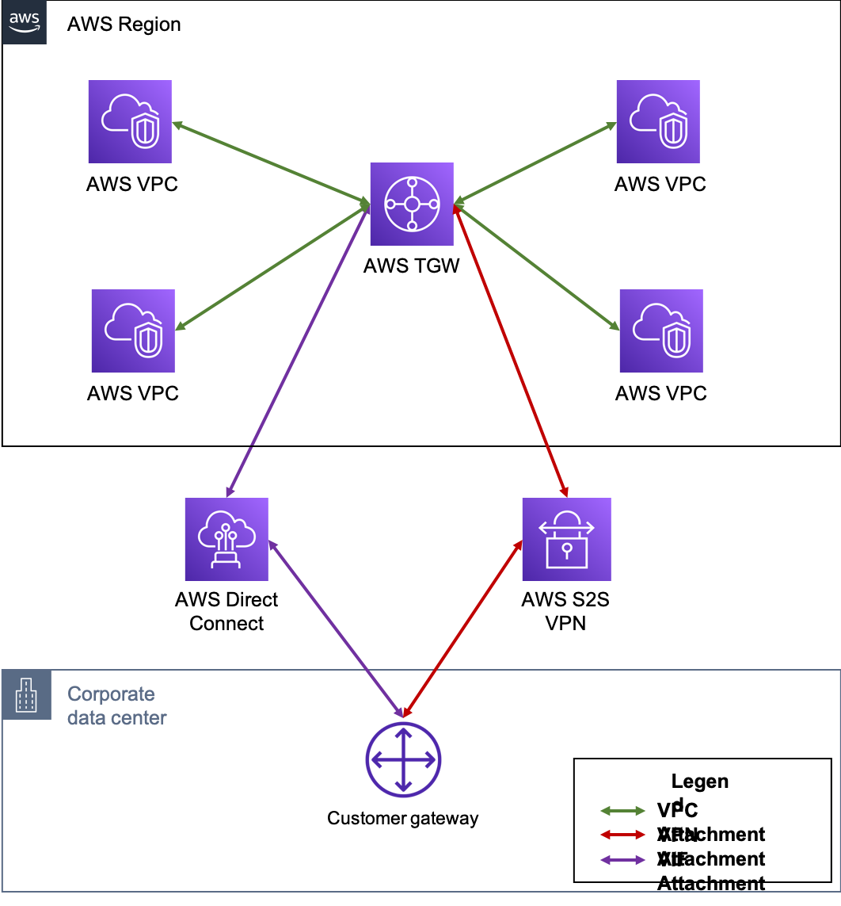

AWS (Gateway Load Balancer (GWLB) is a transparent network gateway that distributes traffic (in a 3/5 tuple flow aware manner) to a fleet of virtual appliances for inspection. This is a regional load balancer that uses GWLB endpoints (GWLBe) to securely intercept data plane traffic within consumer VPCs in the same region.  

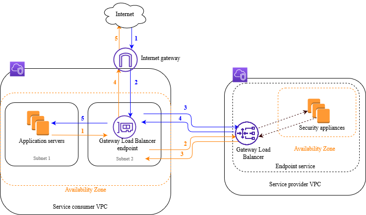

In this workshop we will use all these components to test FortiGate CNF in an enterprise design. 

# AWS Common Architecture Patterns

While there are many ways to organize your infrastructure there are two main ways to design your networking when using GWLB, centralized and distributed. From the perspective of networking, routing, and GWLBe placement.  We will discuss this further below.

FortiGate CNF is a SaaS offering that on the backend uses FortiGates, AWS GWLB, and GWLB endpoints to intercept customer traffic and inspect this transparently. As part of the deployment process for FortiGate CNF instances, the customer environment will need to implement VPC and ingress routing at the IGW to intercept the traffic to be inspected.

The FortiGate CNF security stack which includes the AWS GWLB and other components will deployed in Fortinet managed AWS accounts. The details of the diagram are simply an example of the main components used in FortiGate CNF. This is more to understand what happens when customer traffic is received at our GWLB.

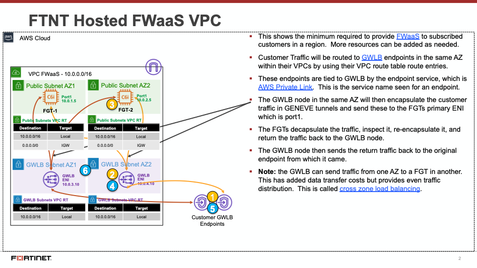

Decentralized designs do not require any routing between the protected VPC and another VPC through TGW. These designs allow simple service insertion with minimal routing changes to the VPC route table. The **yellow numbers** show the initial packet flow for a session and how it is routed (using ingress and VPC routes) to the GWLBe endpoint which then sends traffic to the FortiGate CNF stack. The **blue numbers** show the returned traffic after inspection by the FortiGate CNF stack.

**Note:** Any subnet where the GWLBe for the FortiGate CNF instance is to be deployed will need to have a specific tag name and value to be seen in the FortiGate CNF portal.  Currently this is the tag name '**fortigatecnf_subnet_type**' and tag value '**endpoint**'.

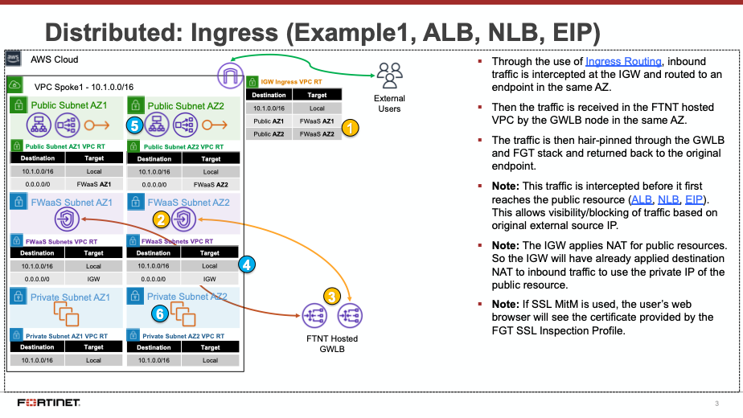

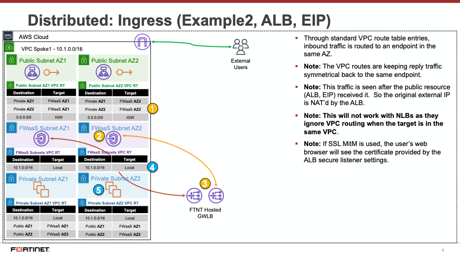

Centralized designs require the use of TGW to provide a simple hub and spoke architecture to inspect traffic. These can simplify east-west and egress traffic inspection needs while removing the need for IGWs and NAT Gateways to be deployed in each protected VPC for egress inspection. You can still mix a decentralized architecture to inspect ingress and even egress traffic while leveraging the centralized design for all east-west inspection.

The **yellow numbers** show the initial packet flow for a session and how it is routed (using ingress, VPC routes, and TGW routes) to the GWLBe which then sends traffic to the FortiGate CNF stack. The **blue numbers (east-west)** and **purple numbers (egress)** show the returned traffic after inspection by the FortiGate CNF stack.

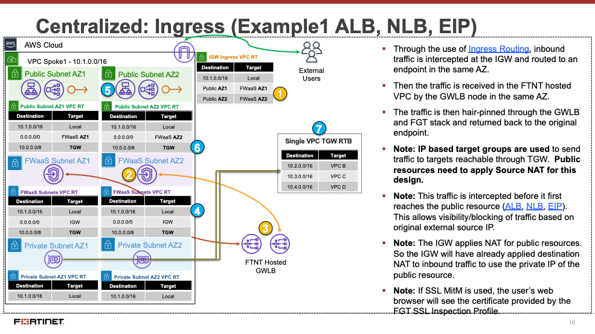

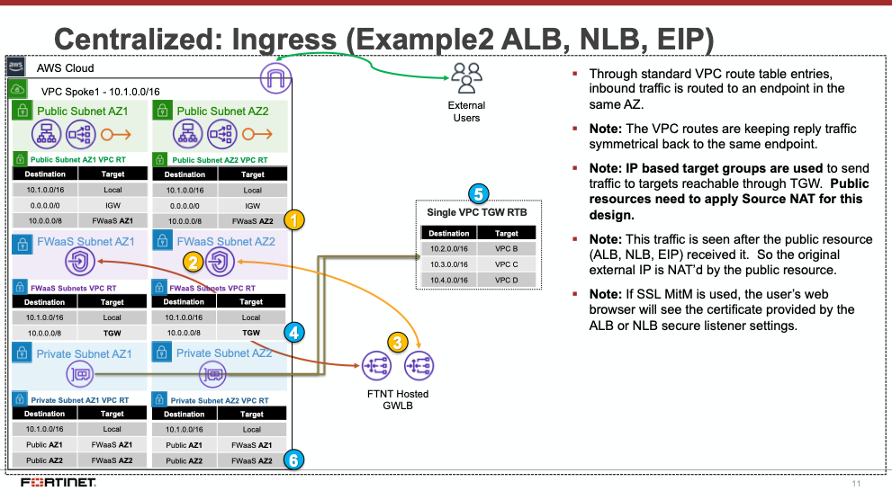

For more examples of distributed and centralized models, please reference the examples on the [FortiGate CNF Admin Guide](https://docs.fortinet.com/document/fortigate-cnf/latest/administration-guide/325439/deployment-scenarios).

# FortiGate CNF Terminology

| Term      | Description |
| ----------- | ----------- |
| CNF Portal      | The Portal in which you deploy CNF instances and manage policy sets      |
| CNF Instance   | A deployment of CNF resources in an auto scale group in the region of your choice       |
| Policy Set      | The group of FW rules, objects, and security profile groups that are assigned to one or many CNF Instance(s)        |
| Security Profile Group      | A group of Layer 7 inspection profiles such as DNS filter, and known bad IP blocking        |

# Task 1: Subscribe to FortiGate CNF in AWS Marketplace

1.  Log into your AWS account and navigate to the AWS Marketplace listing for [FortiGate CNF](https://aws.amazon.com/marketplace/pp/prodview-vtjjha5neo52i).

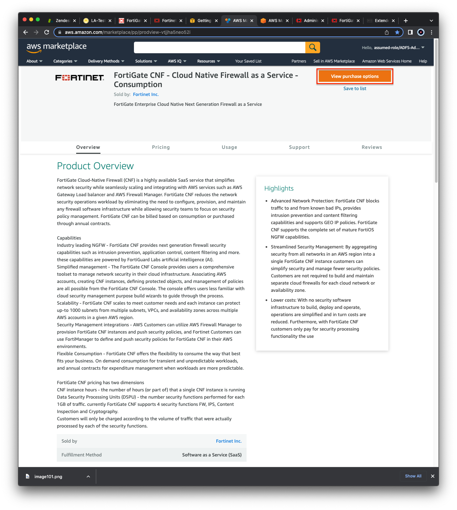

2.  In the upper right corner, click **View purchase options**. On the next page, click **Subscribe**.

~~2.  In the upper right corner, click **Continue to Subscribe**.  On the next page, click **Subscribe**. in the offers section, select the ***Public*** Offer and then click **Subscribe**.  Then in the green banner at the top of your screen, click **Set up your account**.~~

~~2.  In the upper right corner, click **View purchase options**.  Then in the offers section, select the ***Public*** Offer and then click **Subscribe**.  Then in the green banner at the top of your screen, click **Set up your account**.~~

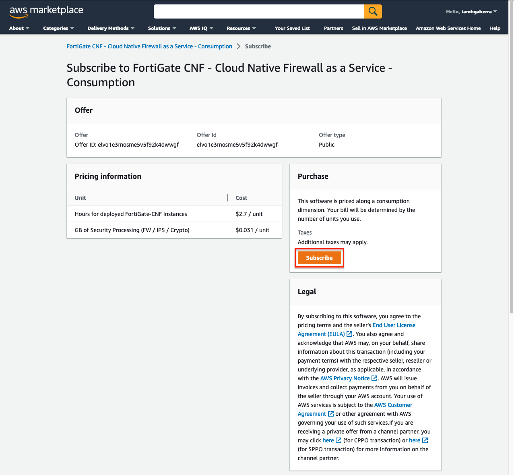

3. A green banner will be at the top of the screen. Click **Set up your account** and this will redirect you to associating this subscription to your FortiCloud account.

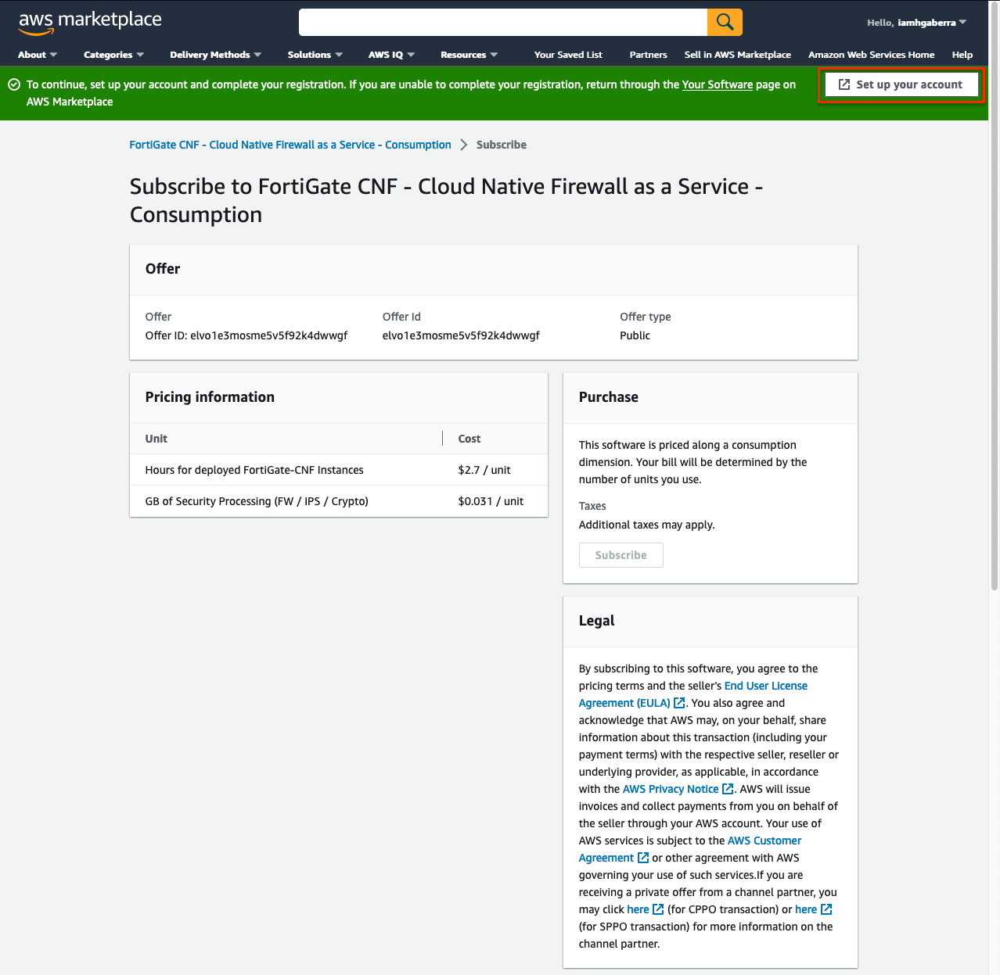

4.  If you do not already have a FortiCloud account, the [Register](https://support.fortinet.com/cred/#/sign-up) button will navigate you to where you can create your own account quickly. Otherwise move on the step 2 and login to your existing FortiCloud Account.

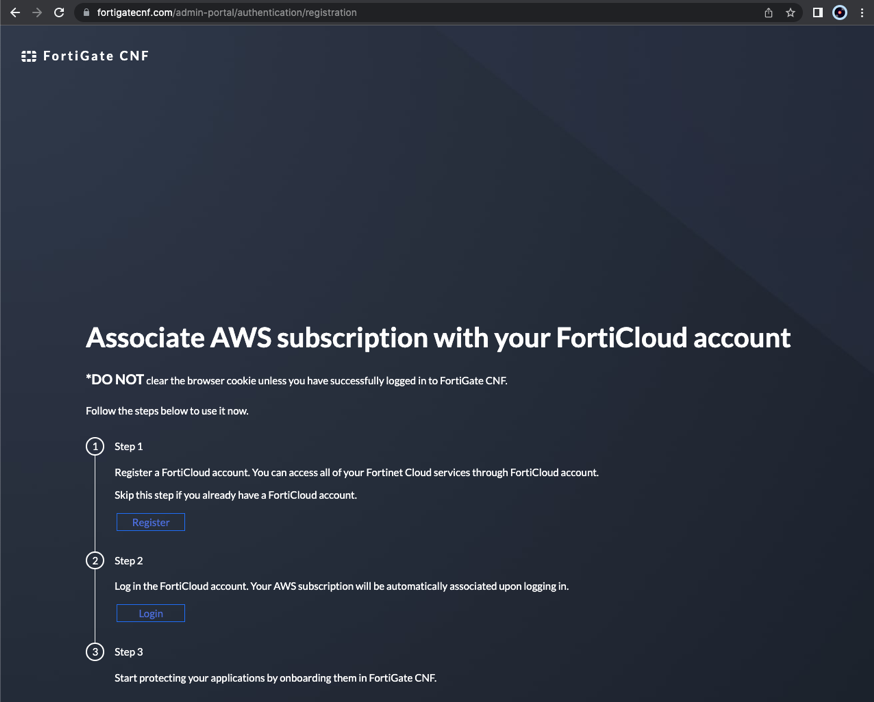

5.  You should see this page showing your information and that the subscription has been successfully applied to your FortiCloud account.

6.  Click on your account and you will now be on the dashboard of FortiGate CNF.

7. This concludes this section.

# Task 2: Onboard an AWS account to FortiGate CNF

1.  In the FortiGate CNF Portal, navigate to AWS Accounts, then click New to start the add account wizard.

2.  In a new browser tab, log into your AWS account and click on your IAM user name in the upper right corner. This will allow you to see and copy your AWS Account ID.

3.  In the FortiGate CNF Portal, provide your AWS account ID and select Launch CloudFormation Template. This will redirect you to the CloudFormation Console in your AWS account.

4.  This CloudFormation Template creates the following items:

    a.  S3 bucket for sending logs

    b.  IAM Cross Account Role which allows us to manage GWLBe endpoints, describe VPCs, push logs to S3, and describe instances and EKS clusters for the SDN connector feature (dynamic address objects based on metadata).

    c.  Custom resources which kicks off automation on our managed accounts to complete onboarding the AWS account.

5.  Please follow through the create stack wizard **without changing any of the parameter values**. Simply follow the steps outlined in the FortiGate CNF.

6.  Once the CloudFormation template has created successfully, you should see your account showing 'Success' in the AWS account page of FortiGate CNF.

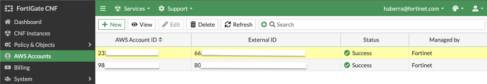

7.  This concludes this section.

# Task 3: Deploying CNF Instances and GWLBe endpoints

1.  In the FortiGate CNF portal, navigate to CNF instances and click New.

2.  Provide a name for the CNF instance, select **us-east-2** for the region for deployment, and select the S3 bucket created by CloudFormation for the logging destination. Then click Save. This will drop you back to the list of CNF instances while this is deployed in the background.

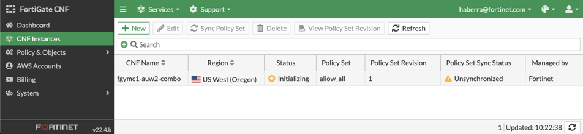

3.  The CNF Instance should show up as **active after roughly 10 minutes** (Now is a great time for a break :) ). Then you can select and edit it to deploy endpoints and assign a policy set.

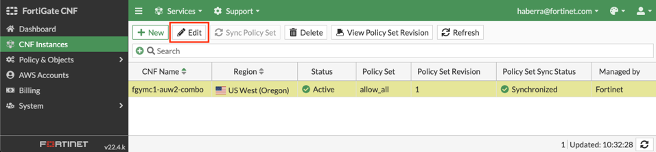

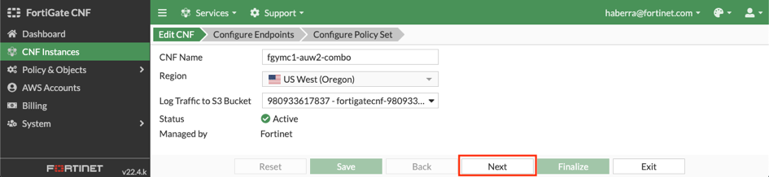

4.  On the Configure Endpoints section of the wizard, click the New button. Then you can select the account, VPC, and subnet to deploy the VPC endpoint to. Repeat this step for all subnets in your architecture where a VPC endpoint should be deployed, then click the Next button.

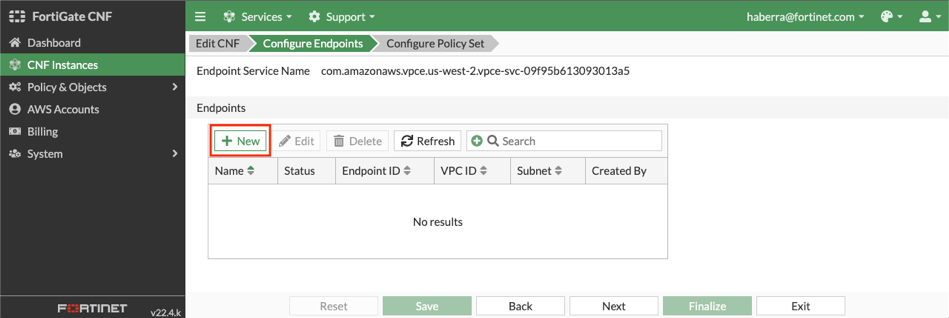

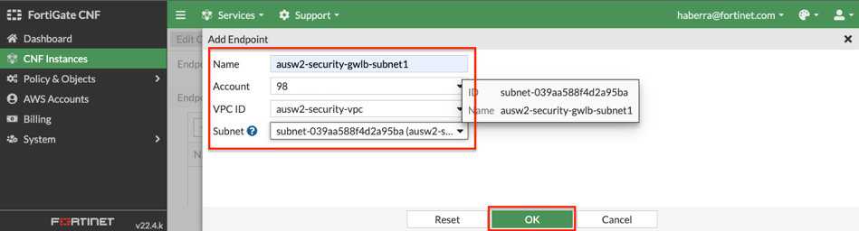

5.  On the Configure Policy Set section of the wizard, use the default 'allow_all' policy allow all traffic from a Layer 4 perspective and click Finalize to push that default policy. You should then see the list of CNF instances again.

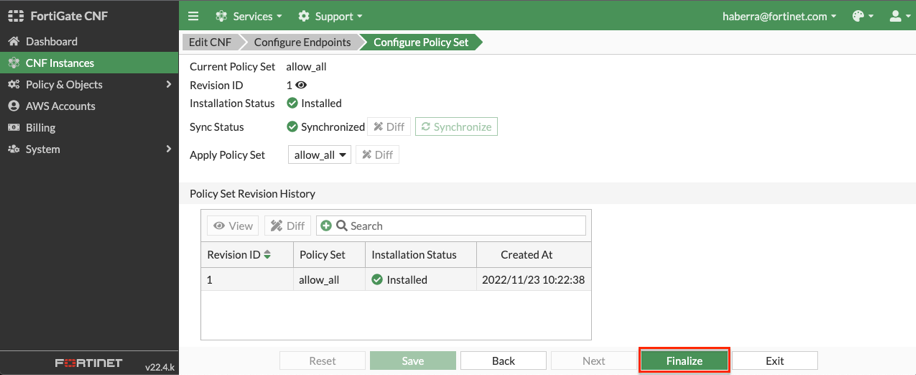

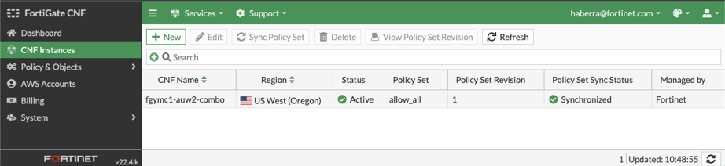

6.  To validate all GWLBe endpoints have been deployed, edit the CNF instance and click Next to view the GWLBe endpoints on the Configure Endpoints section of the wizard.

> 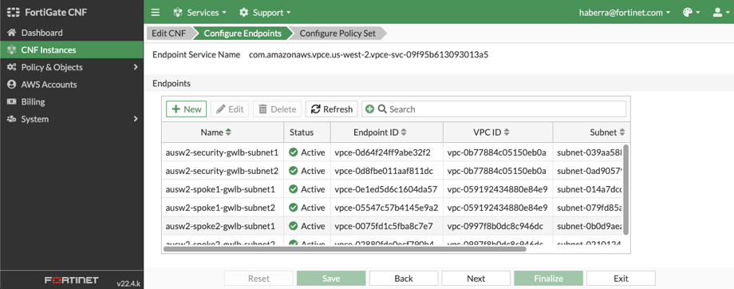

7.  This concludes this section.

# Task 4: Create a policy set and apply it to a FortiGate CNF Instance

1.  To customize the actual Layer 4 rules and security profile groups applied, navigate to Policy & Objects > Policy Sets to create your own L4 rules. Security profiles for DNS filtering and blocking malicious URLs and Botnet C&C can be configured under Policy & Objects > Security Profile Groups.

**Note:** There will be more features added directly in the FortiGate CNF portal over time and shortly after release more security profiles and policy sets can be managed directly by FortiManager.

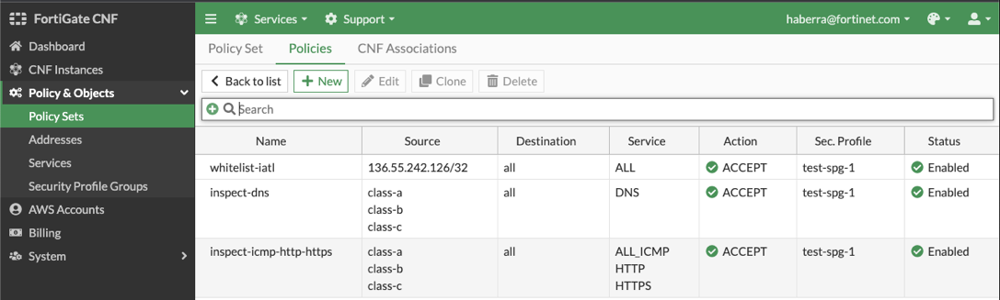

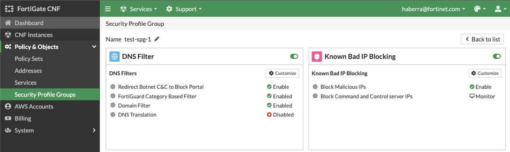

2.  At this point you will need to create ingress and VPC routes to direct traffic to the GWLBe endpoints that were created by FortiGate CNF for inspection. You can confirm the GWLBe endpoints are visible in your AWS account.

3.  As traffic is generated, you will see traffic as well as other logs generated in the S3 bucket over time.

Note: Currently logging to S3 and Syslog is what is available. Logging to remote Syslog and FortiAnalyzer are being developed. In the meantime, we recommend using the AWS CLI S3 sync command to download all logs and parse them quickly with grep.

4. This concludes this section.

# Task 5: Test traffic flows (distributed in + egress and centralized e-w + egress)

--TBD--

# Task 6: Providing Feedback

We truly appreciate your time and efforts to review FortiGate CNF and value your feedback greatly. Please take the time to capture your thoughts on:

1.  What do you like about the FortiGate CNF solution. Does anything beneficial stand out in comparison to the competition?

2.  What room for improvement do you see in the solution. Is there anything we are missing that the competition has or companies are asking for but no solution exists on the market?

3.  For any issues or enhancements, please capture screenshots and provide as much detail as possible. What specific problem or use case does the enhancement solve?

4.  What are your thoughts on using FortiManager to manage policy and objects vs having all items in the FortiGate CNF portal? Any pros/cons for leaning heavy towards one side or is parity expected by customers?

5.  This concludes this section.  **Thank you!!!**
